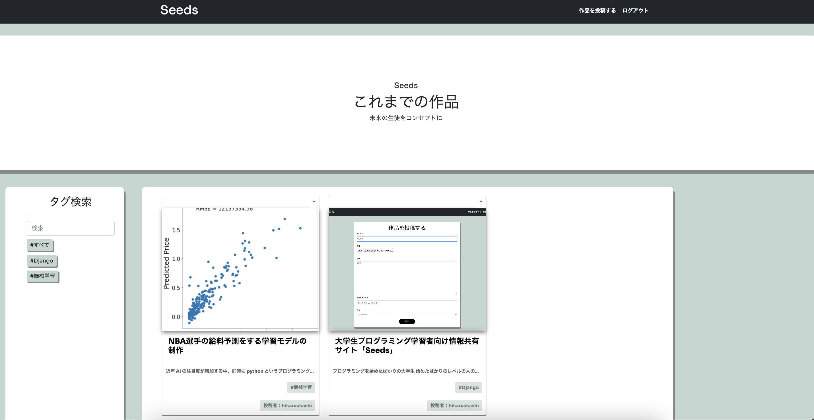
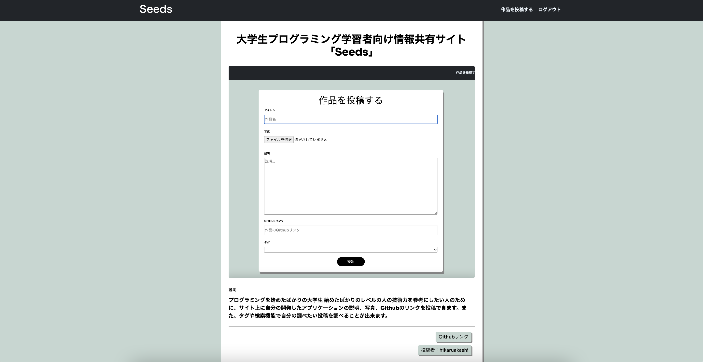
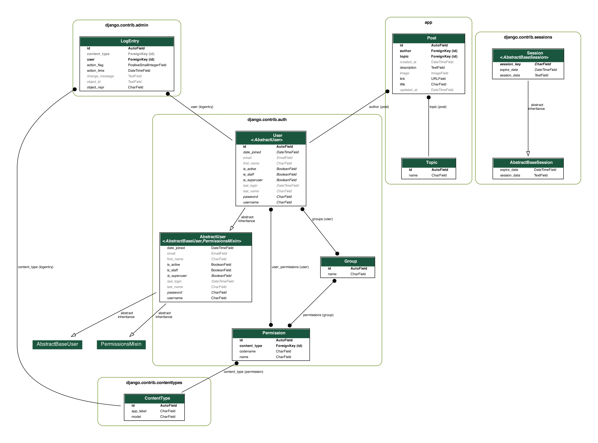

# 大学生プログラミング学習者コミュニティ「Seeds」

URLこちらから
https://seeds.onrender.com

## 作成した人

幼少期からパソコンにハマる  
高校から音楽が好きになり、パソコンでDTMなどのモノづくりを始める  
大学からPythonを学び始め、機械学習などで文法を学んだ上、WEBアプリを作れるDjangoの魅力に気づき、アプリを制作を開始。

# サービスの概要

## Seedsとは

大学生のプログラミング学習者同士の技術レベルを共有するサービスです。

## 誰のために

プログラミングを始めたばかりの大学生
始めたばかりのレベルの人の技術力を参考にしたい人

## 何ができる？
サイト上に自分の開発したアプリケーションの説明、写真、Githubのリンク、その他プログラミングに関する投稿できます。 
また、タグや検索機能で自分の調べたい投稿をすばやく調べることが出来ます。

## アプリの機能一覧

- 記事を投稿する（CRUD処理)  
- タグ検索機能  
- 記事表示機能  
- ワード検索機能  
- ユーザープロフィール機能  
- ログイン、ログアウト機能  
- 会員登録機能  

 
# 技術・開発概要

## モデル設計

## 使用技術

### フロントエンド  
- HTML   
- CSS  
- Bootstrap 5.0.2  

### バックエンド  
- Python 3.10.6
- Django 4.1.5  
- SQL3  

## 開発人数

個人開発一人

## 開発期間・過程

2021年4月~ Python学習開始  
2022年11月~ Django、HTML、CSS学習、WEBアプリ開発開始  
2022年12月~ Bootstrap5、AWS学習開始、インフラ整備開始  

## 開発背景・過程

### このサービスを作ろうと考えたきっかけ
このサービスを作るきっかけは、私が所属しているゼミにありました。  
私が所属するゼミは文系ながらPythonを扱うプログラミング関係のゼミです。  
しかし、このゼミは私たちが1期生でした。  
そしてプログラミング初学者も多いこのゼミで、過去の先輩たちが残した情報や作品もないことが問題ということに気づきました。
そこで、私は担当教員に「これからの後輩たちのためにも、初学者でもわかるような情報を載せれて、また初学者同士の作品のコードを見れるサイト作ります！」と言いこのサイトを制作することになりました。  

## 大変だったこと

### デプロイ、インフラ整備
インフラ整備の全体像を把握することが私はいちばん大変でした。  
私はWebアプリ作成はローカルで開発でのみに集中していました。  
そのため、実際にこのサービスを人々に届けるにはインターネットに公開する必要があるため、AWSを使用しインフラ整備しようとしました。  
しかし、Linux、gunicorn、nginx、route53などの技術一つ一つ把握していき、デプロイをしようとしましたが、独自ドメイン化やhttps化などセキュリティ面での問題が解決できず、Renderを利用したデプロイに切り替えました。  
Renderでのデプロイではサイト上で一定時間経つと投稿した画像が消えるなどまだ問題があります。  

## 工夫したこと

### 工夫1:サイト上のデザイン  

サイト上のデザインにBootstrap5を使い、また、投稿記事をカード表示にし、その他のデザインなど誰でも信頼出来るサイト作りを目指しました。  
近年のWebアプリ、Webデザインはデザイン面に多くの労力を使っており、またその結果ユーザーに安心感を与えると考えました。  
そのため、大学生が作ったサイトだとしてもユーザーから信用を得られるようなデザインになるよう工夫しました。  

### 工夫2:タグ検索機能  

モデルのtopic,descriptionと紐付けた、検索機能と、モデルのtopicとPostを紐付けた、タグ検索により、自分が調べてたい記事を簡単に検索できるようにしました。

## 今後の課題  

### 課題1:ユーザー認証機能  

SNSでの登録、ログイン機能を追加する。  
 

### 課題2:AWS関係のインフラ知識  

今後はAWS等のインフラ周りの知識をしっかりとつけていき、AWSでのデプロイに切り替えていく。  

### 課題3:プロフィール機能の追加  

プロフィールの編集、ホームページから自分の投稿を見れるようにする。  

### 課題４：コミュニティ別に投稿ページを作る機能の追加
学校別、またはゼミ別に投稿ページのグループを作れるシステムを追加して、より波及させていきたい。
